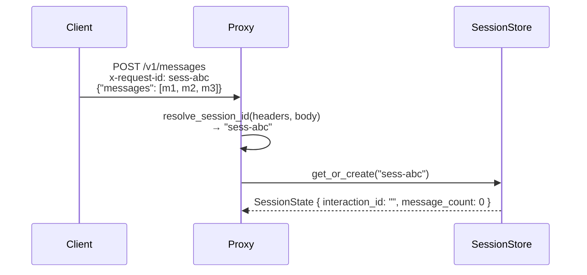
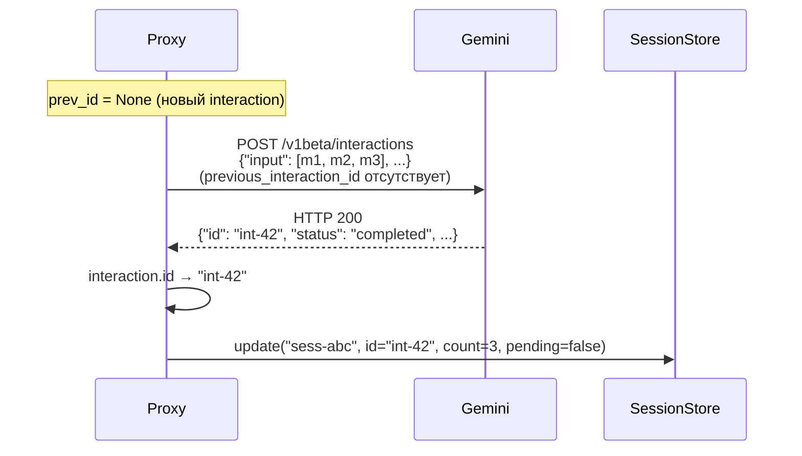
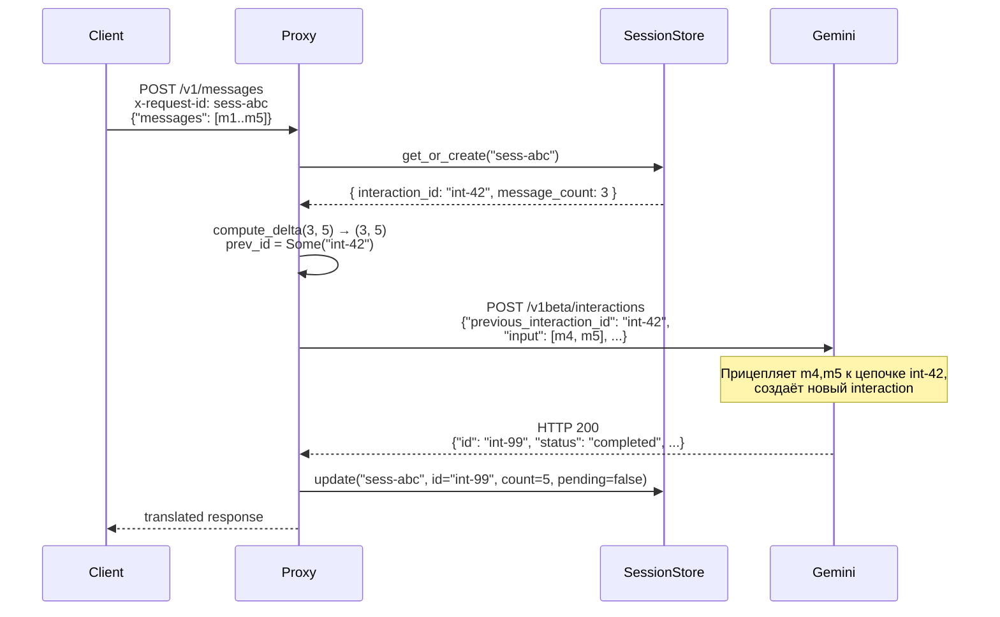
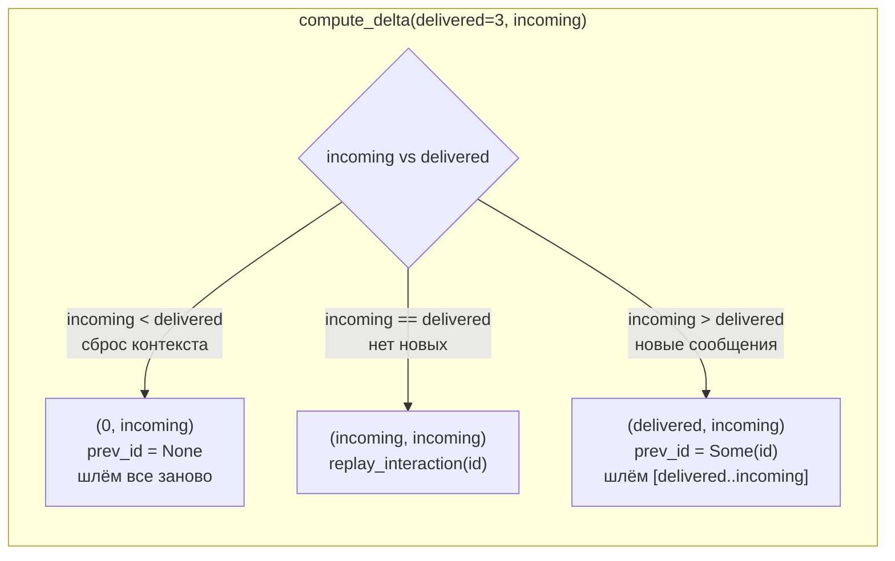
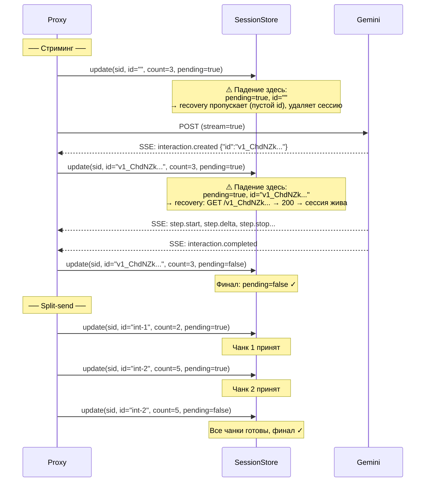

# Delta: Protocol Conversion (Interactions)

**Change ID:** `fix-interactions-protocol-correctness`
**Affects:** `src/interactions_handler.rs`, `src/session.rs`, `src/lib.rs`

---

## ADDED

### Requirement: Interactions Session Identity Model

The interactions protocol has three distinct identity concepts. Understanding which is generated where and how they flow is critical for correctness.

---

**Session ID** — client-side conversation identifier.

| Property | Value |
|----------|-------|
| Source | Client (header or body) |
| Resolved by | `resolve_session_id()` |
| Priority | `X-Client-Request-Id` header > `x-claude-code-session-id` header > `x-request-id` header > `request_id` body field > random |
| Storage | `SessionStore` key |
| Purpose | Links multiple HTTP requests into one stateful conversation |
| Sent to Gemini | **No** — Gemini doesn't know about it |



---

**Interaction ID** — Gemini-generated interaction identifier.

| Property | Value |
|----------|-------|
| Source | Gemini upstream (output-only) |
| Path in response | `Interaction.id` |
| Example | `"v1_ChdNZkE1YXBQOEZLUzRxdHNQcDZMZzBBdxIXUXZBNWFyWDNCYTZNcXRzUDM4N3E2UVE"` (~80 chars, variable length) |
| Stored as | `SessionState.interaction_id` |
| Purpose | Chaining requests: each request references the prior interaction |
| Sent to Gemini | **Yes** — as `previous_interaction_id` in request body |

**Первый запрос (interaction_id создаётся):**



**Второй запрос (interaction_id → previous_interaction_id):**



---

**Message count** — сколько сообщений клиента уже доставлено в Gemini.

| Property | Value |
|----------|-------|
| Source | Proxy (вычисляется) |
| Stored as | `SessionState.message_count` |
| Purpose | Определяет дельту: какие сообщения слать в следующем запросе |
| Sent to Gemini | **No** — это внутреннее состояние прокси |



---

**Pending flag** — маркер незавершённой операции. Нужен для startup recovery после падения процесса.

| Property | Value |
|----------|-------|
| Source | Proxy (выставляется) |
| Stored as | `SessionState.pending` |
| Purpose | После падения процесса recovery знает, какие сессии надо проверить |
| Cleared by | Успешное завершение стрима / всех split-send чанков / `clear_pending` при recovery |

**pending = true** выставляется когда операция началась но ещё не завершена:

- **Стриминг, старт:** `interaction_id = ""`, `pending = true` — interaction ещё не создан
- **Стриминг, после `interaction.created`:** `interaction_id = "v1_ChdNZk..."`, `pending = true` — interaction создан, стрим идёт
- **Split-send, после каждого чанка:** `interaction_id = "int-X"`, `pending = true` — частичный прогресс

**pending = false** выставляется когда операция полностью завершена и ответ отправлен клиенту.



---

**Request ID (x-request-id response header)** — tracing identifier generated by **OpenAI upstream only**.

Gemini **не возвращает** `x-request-id` в ответе. Его типичные response headers:

```
content-type, vary, transfer-encoding, date, server,
x-xss-protection, x-frame-options, x-content-type-options,
server-timing, alt-svc
```

Никакого `x-request-id` или `request-id`. Поэтому для Gemini-трассы корреляция между запросом и ответом — только через `Interaction.id` в теле ответа.

Клиентский `x-request-id` (из заголовка запроса) используется **только** как session identifier для `SessionStore` и никогда не форвардится в Gemini.

---

#### Scenario: Полный жизненный цикл идентификаторов (первый + второй запрос)
- GIVEN клиент начинает новую сессию с `x-request-id: sess-1`
- AND `SessionStore` создаёт `SessionState { interaction_id: "", message_count: 0, pending: false }`
- WHEN клиент шлёт 3 сообщения
- THEN `prev_id = None` (первый запрос)
- AND Gemini создаёт Interaction `{"id": "int-a"}`
- AND `SessionState` обновляется: `interaction_id = "int-a"`, `message_count = 3`
- WHEN клиент шлёт те же 3 + 2 новых = 5 сообщений
- THEN `compute_delta(3, 5)` → `(3, 5)`, `prev_id = Some("int-a")`
- AND запрос к Gemini содержит `"previous_interaction_id": "int-a"` и только сообщения [3..5]
- AND Gemini возвращает `{"id": "int-b"}`
- AND `SessionState` обновляется: `interaction_id = "int-b"`, `message_count = 5`

### Requirement: SSE Buffer Has Maximum Line Cap

Interactions streaming must cap the `buffer` that accumulates SSE data lines at `MAX_SSE_BUFFER_BYTES` (1 MiB). If the buffer exceeds this limit before a `\n\n` delimiter is found, the stream is aborted with an error event and `502 Bad Gateway`.

#### Scenario: Buffer exceeds cap
- GIVEN upstream sends SSE data without `\n\n` delimiters
- WHEN `buffer.len()` exceeds `MAX_SSE_BUFFER_BYTES`
- THEN an SSE `error` event is sent to the client with type `"upstream_error"` and message `"sse buffer exceeded max line length"`
- AND the stream is aborted with a 502 diagnostic record

#### Scenario: Normal SSE parsing unaffected
- GIVEN upstream sends valid SSE events with `\n\n` delimiters
- WHEN each event line is < 1 MiB
- THEN parsing proceeds as before (no cap hit)

### Requirement: System-Instruction Split Has Per-Chunk Session Checkpoints

Each successful system-instruction chunk must update the session with the new `interaction_id` so that retries don't re-send already-created chunks. This mirrors the per-chunk session update pattern in `handle_split_send`.

#### Scenario: Mid-chain failure doesn't duplicate on retry
- GIVEN 3 system-instruction chunks, chunks 1 and 2 succeed, chunk 3 fails
- WHEN the client retries
- THEN session has `interaction_id` from chunk 2
- AND `compute_delta` correctly identifies which messages remain undelivered
- AND already-created chunks are not re-sent

#### Scenario: All chunks succeed — session finalized
- GIVEN all system-instruction chunks succeed
- WHEN the final response is built
- THEN session is updated with the final `interaction_id` and pending cleared

### Requirement: Upstream Stream Error Sends Protocol Error Event

When the interactions upstream stream encounters a read error mid-stream, the proxy must send an SSE `error` event before closing the body. Abrupt body close after HTTP 200 confuses clients.

#### Scenario: Stream read error after partial events
- GIVEN interactions upstream sent some events, then the connection drops
- WHEN the `Err(e)` branch of the stream loop fires
- THEN an SSE `error` event is sent: `event: error\ndata: {"type":"error","error":{"type":"upstream_error","message":"stream read error: ..."}}\n\n`
- AND the channel is closed (no further data)

#### Scenario: Client receives error event
- GIVEN client requested streaming from interactions upstream
- WHEN upstream stream fails
- THEN client receives the SSE error event before body close
- AND the error is properly formatted for the ingress protocol

### Requirement: Proxy-Limit Check After drop_fields

`proxy_limit` size check must run on the body AFTER `drop_fields` stripping. Checking before stripping causes unnecessary split-send paths when stripped fields would have made the body fit.

#### Scenario: Large dropped field doesn't trigger unnecessary split
- GIVEN route has `drop_fields = ["tools"]` and `proxy_limit = 100KB`
- AND request body is 110KB, but `tools` field is 30KB
- WHEN the body is processed
- THEN `drop_fields_from_value` strips tools first (body → 80KB)
- AND 80KB fits under 100KB limit → no splitting
- INSTEAD OF: checking 110KB > 100KB first and entering split-send unnecessarily

#### Scenario: Genuinely oversized body still splits
- GIVEN route has `drop_fields = ["tools"]` and `proxy_limit = 100KB`
- AND after dropping tools, body is still 120KB
- WHEN the body is processed
- THEN split-send is triggered (correctly)

### Requirement: get_interaction Guards Against Empty interaction_id

`get_interaction` must return `Ok(false)` immediately when `interaction_id` is empty. An empty ID constructs `GET /v1beta/interactions/` (the list endpoint), which returns 200 and causes recovery to treat the session as found.

#### Scenario: Empty interaction_id returns false immediately
- GIVEN `interaction_id = ""`
- WHEN `get_interaction("", route)` is called
- THEN `Ok(false)` is returned without making an HTTP request
- AND recovery removes the session (no valid interaction to recover)

#### Scenario: Non-empty ID works as before
- GIVEN `interaction_id = "int-123"`
- WHEN `get_interaction("int-123", route)` is called
- THEN GET `/v1beta/interactions/int-123` is sent (existing behavior unchanged)

### Requirement: Zero-Message Requests on New Sessions Return Error

When a client sends an empty `messages` array on a new session (no prior `interaction_id`), the handler must return `400 Bad Request` instead of entering the replay branch and returning `500 Internal Server Error`.

#### Scenario: Empty messages on new session
- GIVEN session has `{interaction_id: "", message_count: 0}`
- AND client sends `messages: []`
- WHEN handler processes the request
- THEN `compute_delta(0, 0)` returns `(0, 0)` → `start_index == incoming_count`
- AND since `prev_id` is `None` (no interaction_id), return `400 Bad Request` "empty messages on new session"
- INSTEAD OF: returning `500 Internal Server Error` "session has no interaction_id for replay"

#### Scenario: Empty messages with existing interaction (replay)
- GIVEN session has `{interaction_id: "int-1", message_count: 5}`
- AND client sends 5 messages
- THEN `compute_delta(5, 5)` returns `(5, 5)` → replay branch
- AND `prev_id = Some("int-1")` → `replay_interaction("int-1")` is called (unchanged)

### Requirement: Synthetic OpenAI SSE Chunks Use Real Timestamp

Synthetic OpenAI SSE chunks must use the current Unix timestamp for the `created` field, not hardcoded `0`.

#### Scenario: Timestamp is current
- GIVEN a split-send streaming response for OpenAI ingress
- WHEN `openai_sse_chunk` synthesizes chunks
- THEN `created` field is `SystemTime::now().duration_since(UNIX_EPOCH).unwrap().as_secs()`
- AND all chunks in a single response share the same timestamp (captured once)

#### Scenario: Anthropic SSE path unaffected
- GIVEN a split-send streaming response for Anthropic ingress
- WHEN `synthesize_anthropic_sse` builds events
- THEN behavior is unchanged (Anthropic protocol doesn't use `created`)

---

## MODIFIED

### Requirement: Split-Send Session Progress Uses Content Index

**Change:** Session update must happen **immediately after successful HTTP response** (status 200), before body read/validation/deserialization. Previously the update was after deserialization; if deserialization failed, the session was stale and retry duplicated content.

#### Scenario: Deserialization failure after HTTP 200 doesn't lose progress
- GIVEN upstream returns HTTP 200 with valid `Interaction`, but body read fails
- WHEN the handler processes the response
- THEN `session_store.update` is called with the `interaction_id` from response headers (if parsable) or with progress metadata
- AND on retry, the already-accepted chunk is NOT re-sent

### Requirement: Upstream Response Headers Forwarded Through Interactions Success

**Change:** Add `copy_interactions_response_headers` function with a whitelist matching the standard handler patterns. All diagnostics paths must filter response headers through the whitelist.

#### Scenario: Rate-limit headers forwarded
- GIVEN interactions upstream returns `x-ratelimit-*` headers
- WHEN the handler builds the success response
- THEN rate-limit headers are forwarded to the client (unchanged)

#### Scenario: Sensitive headers NOT captured in diagnostics
- GIVEN interactions upstream returns `Set-Cookie` or `X-Internal-Trace` header
- WHEN diagnostics records response headers
- THEN non-whitelisted headers are excluded from the dump
- AND whitelisted headers (x-request-id, ratelimit-*, etc.) are still captured

### Requirement: Interactions Header Forwarding Maps Correlation IDs Correctly

**Change:** `build_interactions_headers_map` must not forward `x-request-id` to upstream — it is generated by upstream, not by the proxy. The proxy's job is to map the client's session identifier (`x-request-id`) to the upstream protocol's correlation mechanism. Mapping rules depend on upstream protocol.

`x-request-id` serves as the client-side session identifier. It is **never** forwarded to upstream as-is in any handler. The standard passthrough handlers have the same bug (forwarding `x-request-id` to upstream) but that's out of scope for this change.

---

**Gemini upstream** (interactions API, `endpoint_interactions`):

Stateful protocol. Session continuity is maintained via `previous_interaction_id` in the request body — each request references the ID of the prior interaction. HTTP correlation headers are not needed for session tracking. Current implementation correct.

The `x-request-id` → session state mapping happens at the ingress boundary: `resolve_session_id` extracts the client's session identifier from `x-request-id` header → session store tracks `interaction_id` + `message_count` → delta computation determines `previous_interaction_id` for the outgoing body.

#### Scenario: Gemini session correlation via previous_interaction_id
- GIVEN session `{interaction_id: "int-1", message_count: 3}`
- WHEN client sends 5 messages with `x-request-id: sess-abc`
- THEN `prev_id = Some("int-1")` is set in the outgoing `CreateModelInteractionParams`
- AND `previous_interaction_id: "int-1"` is sent in the request body
- AND Gemini chains this request to interaction `int-1`

---

**OpenAI upstream** (passthrough/conversion via `endpoint_openai`):

Stateless protocol. `X-Client-Request-Id` is OpenAI's HTTP correlation header.

| Client sends | Upstream receives | Rule |
|-------------|-------------------|------|
| `x-request-id` only | `X-Client-Request-Id: <value>` | Map `x-request-id` → `X-Client-Request-Id` (if client didn't send `X-Client-Request-Id`) |
| `x-claude-code-session-id` only | `X-Client-Request-Id: <value>` | Map `x-claude-code-session-id` → `X-Client-Request-Id` |
| `X-Client-Request-Id` | `X-Client-Request-Id: <value>` | Passthrough |
| None | (absent) | No correlation header sent |

#### Scenario: x-claude-code-session-id mapped to X-Client-Request-Id for OpenAI
- GIVEN client sends `x-claude-code-session-id: sess-1`
- WHEN forwarding to OpenAI upstream
- THEN `X-Client-Request-Id: sess-1` is set

---

**Anthropic upstream** (passthrough/conversion via `endpoint_anthropic`):

Uses `x-claude-code-session-id` for session correlation.

| Client sends | Upstream receives | Rule |
|-------------|-------------------|------|
| `x-request-id` only | `x-claude-code-session-id: <value>` | Map `x-request-id` → `x-claude-code-session-id` (if client sent `x-request-id`) |
| `x-claude-code-session-id` | `x-claude-code-session-id: <value>` | Passthrough |
| None | (absent) | No correlation header sent |

#### Scenario: x-request-id mapped to x-claude-code-session-id for Anthropic
- GIVEN client sends `x-request-id: req-abc` (no `x-claude-code-session-id`)
- WHEN forwarding to Anthropic upstream
- THEN `x-claude-code-session-id: req-abc` is set
- AND `x-request-id` is NOT forwarded

#### Scenario: x-claude-code-session-id passthrough to Anthropic
- GIVEN client sends `x-claude-code-session-id: sess-1`
- WHEN forwarding to Anthropic upstream
- THEN `x-claude-code-session-id: sess-1` is forwarded as-is

### Requirement: Replay Requests Use Standard Header Construction

**Change:** `replay_interaction` must use `build_interactions_headers_map` / `build_interactions_headers` for header construction and record an egress dump, matching non-replay request paths.

#### Scenario: Replay forwards client headers
- GIVEN exact retry triggers `replay_interaction`
- WHEN GET request is built
- THEN `build_interactions_headers` is used (same as non-replay paths)
- AND request-id/session headers from the client are forwarded upstream
- AND `guard.egress_dump(...)` records the replay request in diagnostics

#### Scenario: Replay API key still sent
- GIVEN route has `api_key` configured
- WHEN `replay_interaction` builds the GET request
- THEN `x-goog-api-key` header is included (via `build_interactions_headers_map`)

### Requirement: Api-Revision Cannot Be Overridden by Client

**Change:** `build_interactions_headers_map` must insert the fixed `Api-Revision` header **after** forwarding client headers, so the fixed value wins even if the client sends `Api-Revision`.

#### Scenario: Client Api-Revision ignored
- GIVEN client sends `Api-Revision: 2025-01-01`
- WHEN `build_interactions_headers_map` builds headers
- THEN forwarded headers include client's `Api-Revision: 2025-01-01`
- AND the subsequent `headers.insert("Api-Revision", "2026-05-20")` overwrites it
- AND upstream receives `Api-Revision: 2026-05-20`

### Requirement: Split-Send Error Stats Use Actual Stream Flag

**Change:** All calls to `finish_with_upstream_error` in `handle_split_send` and `send_split_system_instruction` must pass the `stream` parameter instead of hardcoded `false`.

#### Scenario: Streaming split error correctly classified
- GIVEN client requests `stream: true` and split chunk receives non-2xx
- WHEN `finish_with_upstream_error` records the error
- THEN `stats.streaming` is `true`
- INSTEAD OF: `false` (hardcoded)

### Requirement: Session Persistence Uses spawn_blocking for Disk I/O

**Change:** `SessionStore::save_to_disk` must wrap `fs::write` + `fs::rename` in `tokio::task::spawn_blocking` to avoid stalling async workers on slow disk.

#### Scenario: Slow disk doesn't block request processing
- GIVEN disk is slow (magnetic HDD, network FS, etc.)
- WHEN concurrent requests call `session_store.update`
- THEN each `save_to_disk` runs in `spawn_blocking`
- AND other async tasks (HTTP handling) are not stalled by the synchronous disk write

### Requirement: OpenAI max_completion_tokens Respected in Interactions Path

*(Unchanged — listed for reference as it's part of the interactions path.)*

---

## REMOVED

(None)
