# Delta: Protocol Conversion

**Change ID:** `redesign-session-state-model`
**Affects:** `openspec/specs/protocol-conversion.md`, `src/interactions.rs`, `src/interactions_handler.rs`, `src/sse.rs`

---

## MODIFIED

### Requirement: Anthropic -> Interactions Translation

Anthropic ingress still converts to `CreateModelInteractionParams`, but delta selection changes from `compute_delta(message_count, incoming)` to hash frontier selection over filtered harness messages.

Rules:
- Control messages are stripped before hashing and conversion.
- Harness messages are Anthropic `user` messages only.
- `previous_interaction_id` is the terminal interaction returned by longest valid prefix selection.
- `system_instruction`, `tools`, `tool_choice`, and `generation_config` are included only when `previous_interaction_id` is `None`.
- If all incoming harness messages are known, handler fetches the existing interaction from upstream (`GET /v1beta/interactions/{id}`) and translates its response — no `POST` call is made.
- When `previous_interaction_id` is `Some(...)` but the client's current `system` field differs from what was sent in the first interaction, the proxy MUST log an error-level message and treat the mismatch as a fork: discard `previous_interaction_id`, treat `prev_id = None`, include `system_instruction`, `tools`, and `generation_config`. Upstream Gemini does not accept `system_instruction` mid-chain.
- Anthropic `system_instruction_hash` is `xxh3-64(serde_json::to_vec(system_instruction_value))` over the converted Gemini `system_instruction` value built from Anthropic `system`; it is not a harness message hash.

#### Scenario: Subsequent request — hash delta + chain
- GIVEN known Anthropic harness hashes `[0xA, 0xB]` ending at `int-2`
- WHEN request contains user hashes `[0xA, 0xB, 0xC]`
- THEN only message `0xC` is translated
- AND `previous_interaction_id = "int-2"`
- AND first-interaction fields are absent

#### Scenario: History rewrite starts new interaction
- GIVEN known hashes `[0xA, 0xB]` in two separate interactions (`int-A -> int-B`)
- WHEN incoming user hashes are `[0xA, 0xX]`
- THEN longest valid prefix is `[0xA]`
- AND only messages from `0xX` onward are sent with `previous_interaction_id = "int-A"`

#### Scenario: History rewrite forks inside interaction
- GIVEN `int-1` has `message_hashes = [0xA, 0xB, 0xC]`, `prev_id = int-0`
- WHEN incoming user hashes are `[0xA, 0xB, 0xD]`
- THEN fork at `int-0`, forward messages for `[0xA, 0xB, 0xD]`
- AND `previous_interaction_id = int-0`
- AND `system_instruction`, `tools`, `generation_config` are included (prev_id is None → new chain)

#### Scenario: No known prefix includes first-interaction fields
- GIVEN no valid prefix for incoming user hashes
- WHEN Anthropic request is built
- THEN all user messages are sent
- AND `system_instruction`, `tools`, and `generation_config` are included

### Requirement: OpenAI -> Interactions Translation

OpenAI ingress still converts to `CreateModelInteractionParams`, but delta selection changes from raw message count to hash frontier selection over filtered harness messages.

Rules:
- Control messages are stripped before hashing and conversion.
- Harness messages are roles `system`, `developer`, `user`, and `tool`.
- `assistant` messages are ignored for frontier and are not sent upstream.
- `previous_interaction_id` comes from longest valid prefix selection.
- `system_instruction`, `tools`, `tool_choice`, and `generation_config` are included only when `previous_interaction_id` is `None`.
- If all incoming harness messages are known, handler fetches the existing interaction from upstream (`GET /v1beta/interactions/{id}`) and translates its response — no `POST` call is made.
- When `previous_interaction_id` is `Some(...)` but the client's current `system`/`developer` messages produce a system_instruction whose xxh3 hash differs from the root `ClientInteractionNode.system_instruction_hash`, the proxy MUST log an error-level message and treat the mismatch as a fork: discard `previous_interaction_id`, treat `prev_id = None`, include `system_instruction`, `tools`, and `generation_config`. Upstream Gemini does not accept `system_instruction` mid-chain.
- OpenAI `system_instruction_hash` is `xxh3-64(serde_json::to_vec(system_instruction_value))` over the converted Gemini `system_instruction` value built from `system` + `developer` messages joined with newline; it is not a harness message hash.

**Limitation:** Only harness messages participate in frontier selection. Client-resubmitted `assistant` messages (Anthropic) and `assistant` role (OpenAI) are invisible to frontier. If the client modifies history in a way that affects only assistant messages while keeping harness messages identical, the proxy will NOT detect the change and will replay the cached interaction chain. This is by design: assistant messages are LLM-generated and the client cannot meaningfully alter them without also altering the subsequent harness context.

#### Scenario: Assistant history ignored
- GIVEN OpenAI request messages are `[system, user, assistant, tool]`
- WHEN harness messages are filtered
- THEN hashes are computed only for `[system, user, tool]`

#### Scenario: Developer message extracted into system_instruction
- GIVEN OpenAI request messages are `[system: "You are helpful", developer: "Use tools", user: "Hello"]`
- WHEN harness messages are filtered
- THEN hashes are computed for `[system, developer, user]`
- AND `system_instruction` is built from `system` + `developer` messages concatenated with newline
- AND only `user: "Hello"` is converted to Content

#### Scenario: Subsequent request omits first-interaction fields
- GIVEN known harness prefix ends at `int-2`
- WHEN OpenAI request adds one new `user` message
- THEN only that user message is sent
- AND `previous_interaction_id = "int-2"`
- AND tools/system/generation config are absent

### Requirement: Proxy-Limit Split-Send Chunk Forwarding

Existing full-body split-send invariants MUST be preserved while state tracking changes to `InFlightStore`.

Split packing MUST:
- measure full serialized `CreateModelInteractionParams` body;
- split `system_instruction` before content when needed;
- first system-instruction chunk carries `tools`, `generation_config`, and first part of `system_instruction`;
- each subsequent system-instruction chunk carries its part of `system_instruction` + `previous_interaction_id` (no `tools`/`generation_config`);
- the last system-instruction chunk can also pack content items when they fit;
- content-only chunks (after system_instruction) carry `previous_interaction_id` and omit `tools`, `generation_config`, and `system_instruction`;
- account for serialized `previous_interaction_id` overhead during size estimation;
- reject unsplittable requests before sending any piece.

State updates MUST use `InFlightBatch` piece statuses, not per-chunk `message_count` updates. The terminal interaction node is inserted only after all pieces ACK.

#### Scenario: Split creates upstream nodes and one client node
- GIVEN one harness message splits into two upstream chunks
- WHEN both chunks ACK `int-A` and `int-B`
- THEN `UpstreamInteractionNode`s for `int-A` and `int-B` are inserted
- AND `ClientInteractionNode { id: "int-B", upstream_ids: ["int-A", "int-B"], message_hashes: [0xH0] }` is inserted

#### Scenario: Failed second chunk leaves no client node
- GIVEN first chunk ACKs `int-A`
- WHEN second chunk fails
- THEN `int-A` is cancelled best-effort
- AND no `ClientInteractionNode` is inserted
- AND `UpstreamInteractionNode` for `int-A` is removed (cleanup)

#### Scenario: System instruction split preserves first fields
- GIVEN system instruction exceeds `proxy_limit`
- WHEN split-send starts
- THEN first system chunk carries `tools` and `generation_config`
- AND each system chunk carries its part of `system_instruction`
- AND later chunks chain via `previous_interaction_id`

### Requirement: Split-Send Response Merging

When split-send completes, the proxy MUST present one coherent response to the client with the terminal upstream interaction's ID (`ClientInteractionNode.id`). Intermediate upstream interaction IDs (stored in `ClientInteractionNode.upstream_ids`) MUST NOT be exposed to the client.

**Live split:** collect all `Interaction` responses from each piece as they arrive, merge text content and tool calls into one composite response, return with `ClientInteractionNode.id`.

**Retry after split:** when frontier selects a `ClientInteractionNode` with `upstream_ids.len() > 1`, fetch all upstream interactions from the `upstream_ids` list via GET, merge their content into one composite response, return with the client node's `id`.

**Streaming:** buffer all upstream SSE responses from all pieces, substitute every intermediate `interaction.id` with the final ID, then drain one translated SSE stream. See "Split-Send Streaming with Buffered SSE" below.

**Merge semantics:**

- `Interaction.steps[]` arrays are concatenated in upstream piece order (P0 steps, then P1 steps, …). Gemini Interactions schema: `Resp1 { steps: [r1_s1, r1_s2] } + Resp2 { steps: [r2_s1] } → Client_Resp { steps: [r1_s1, r1_s2, r2_s1] }`.
- Fields from the LAST piece's `Interaction` are used for:
  - `usage` (all token counters — resource accounting after last piece processed)
  - `id` (terminal upstream id becomes client-visible id)
- Fields from the FIRST piece's `Interaction` are used for unique structural fields:
  - `tools` returned by first piece (`Interaction.tools`)
  - `system_instruction` returned by first piece
  - `generation_config` returned by first piece
- For Anthropic ingress, the merged `steps[]` are re-serialized into `MessageResponse.content[]` preserving step order. A `FunctionCallStep` after a `TextGenerationStep` becomes a `tool_use` block after a `text` block in order.
- For OpenAI ingress, `steps[]` are translated to `ChatCompletionResponse.choices[].message` with tool calls and content assembled from the step order.

#### Scenario: Non-streaming two-piece merge
- GIVEN P0 returns `int-A` with text "Hello" and P1 returns `int-B` with text " world"
- WHEN split-send completes
- THEN client receives one response with text "Hello world" and interaction id `int-B`
- AND `int-A` is never visible to the client

#### Scenario: Non-streaming merge preserves tool calls
- GIVEN P0 returns text and P1 returns `FunctionCallStep` for `get_weather`
- WHEN split-send completes
- THEN client receives one response containing both text and tool_use block
- AND response uses final interaction id

#### Scenario: Retry after split fetches via upstream_ids
- GIVEN `ClientInteractionNode { id: "int-B", upstream_ids: ["int-A", "int-B"], message_hashes: [0xH0] }`
- WHEN client retries with matching harness hashes and frontier selects the client node
- THEN handler fetches `GET /int-A` and `GET /int-B` from upstream
- AND merges content from both into one response with id `int-B`
- AND `int-A` is never visible to the client

### Requirement: Split-Send Streaming with Buffered SSE

When original ingress has `stream: true` and split-send is required, the handler MUST buffer all upstream piece SSE responses until the final interaction id is known, substitute intermediate ids with the final id, then emit one coherent client-visible SSE stream.

For Anthropic clients, buffered interactions SSE is translated to Anthropic `StreamEvent` SSE after substitution.
For OpenAI clients, the substituted Anthropic-style stream is passed through `ReverseStreamingTranslator` to produce OpenAI chat-completion chunks.

The initial buffer is memory-backed with 100 MB limit counted as total raw SSE bytes pushed into the buffer after upstream reads and before client translation. On overflow, ACKed piece interactions are cancelled best-effort/asynchronously and the batch is marked failed.

```rust
trait SseBuffer {
    fn push(&mut self, piece_index: usize, bytes: &[u8]) -> Result<(), SseBufferError>;
    fn substitute_id(&mut self, from: &str, to: &str);
    fn drain(self) -> Vec<u8>;
    fn len_bytes(&self) -> usize;
}

struct MemSseBuffer {
    limit_bytes: usize, // default: 100 * 1024 * 1024
}
```

`push` stores serialized upstream SSE bytes exactly as received for each piece. `substitute_id` rewrites buffered bytes before protocol-specific client translation. `drain` emits piece buffers in piece order.

#### Scenario: Two-piece streaming response uses final id
- GIVEN P0 creates `int-A` and P1 creates `int-B`
- WHEN client receives streamed response
- THEN all client-visible message/interaction identifiers reference `int-B`
- AND no event exposes `int-A`

#### Scenario: Buffer overflow fails safely
- GIVEN buffered raw upstream SSE bytes exceed 100 MB
- WHEN `MemSseBuffer::push` detects overflow
- THEN ACKed pieces are cancelled best-effort/asynchronously
- AND the batch is marked failed
- AND the client receives an error response/event

---

## Appendix: Mermaid Sequence Diagrams

### Successful: First request (no split)

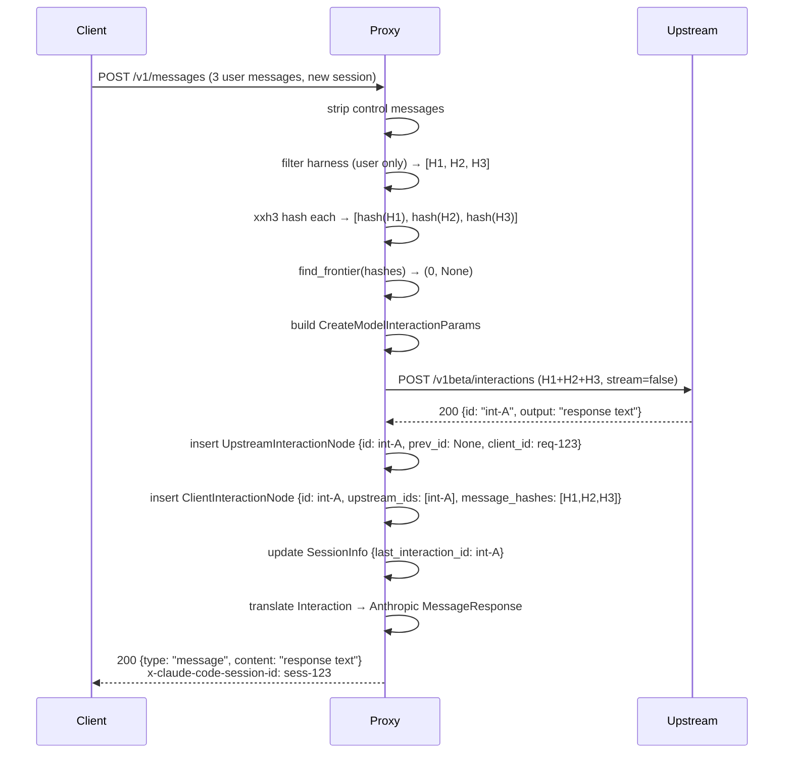

### Successful: Continuation via frontier

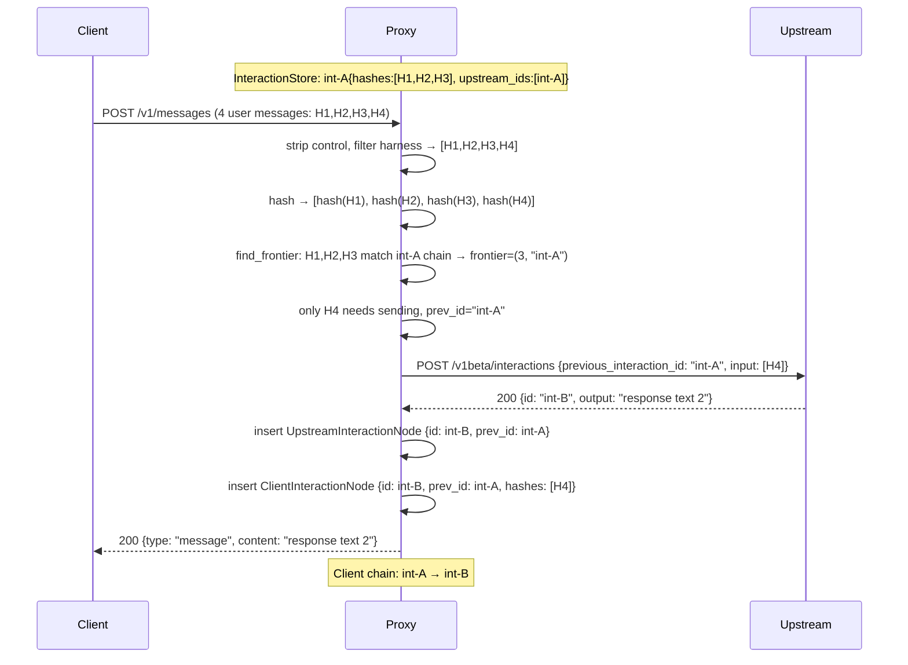

### Successful: History rewrite — fork inside interaction

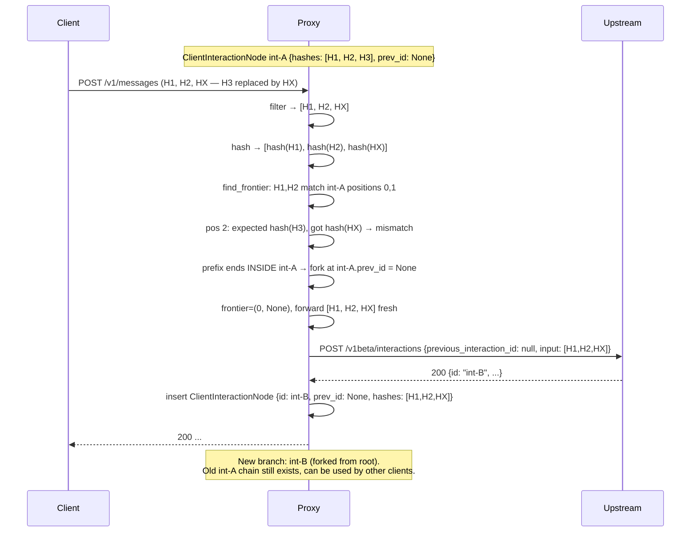

### Successful: Exact retry — all messages known (no split)

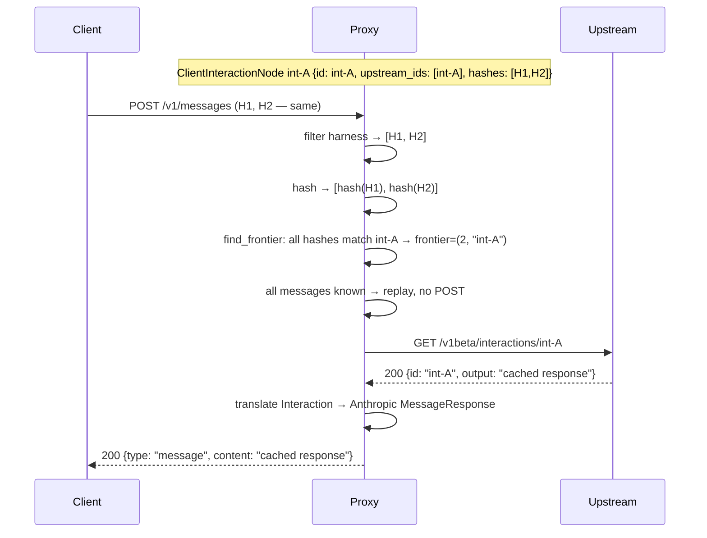

### Successful: Exact retry after split (merge multiple upstreams)

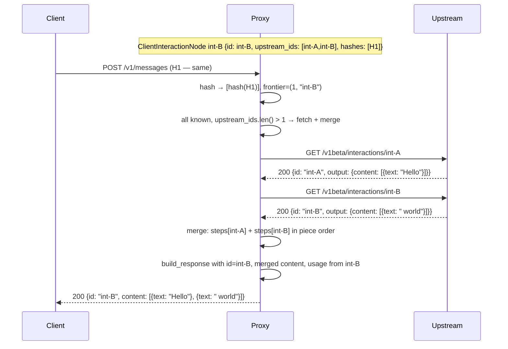

### Successful: Split-send 2 pieces

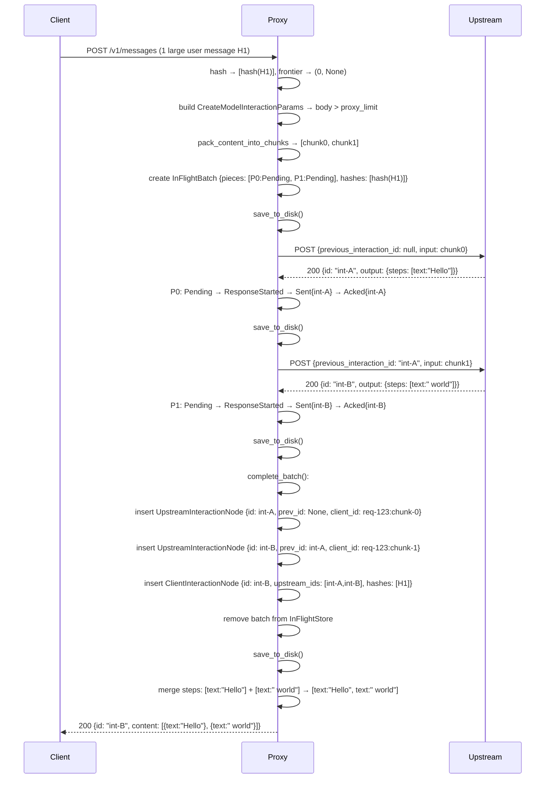

### Successful: Split-send with system_instruction

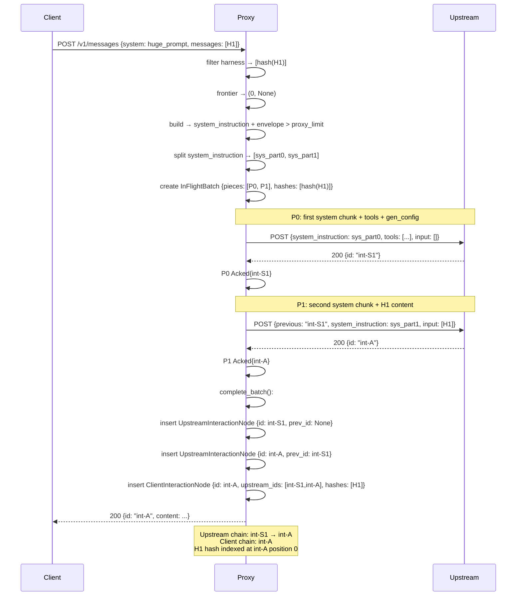

### Failure: Split-send second piece fails

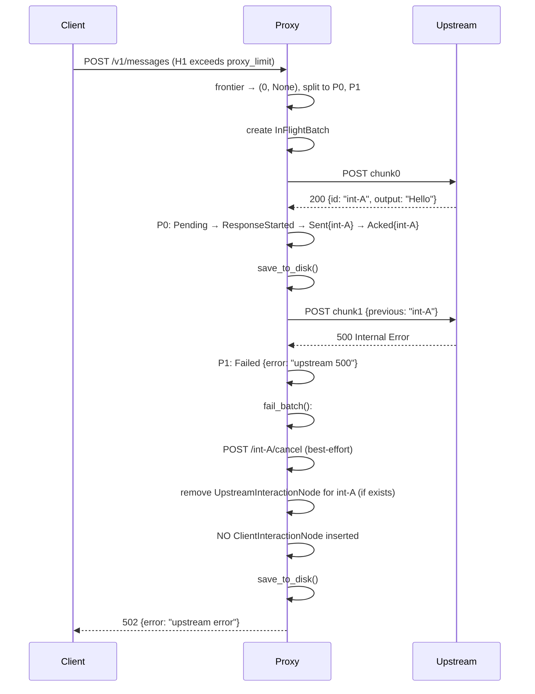

### Failure: Crash mid-split + recovery

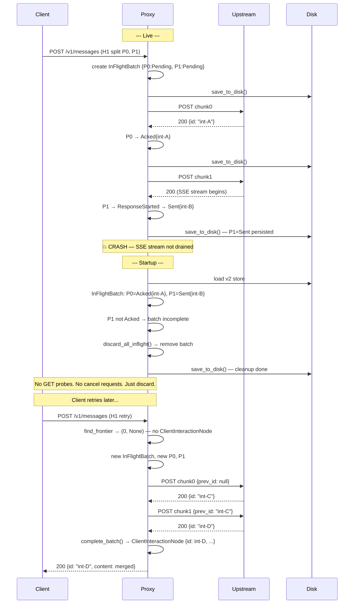

### Successful: Streaming split-send

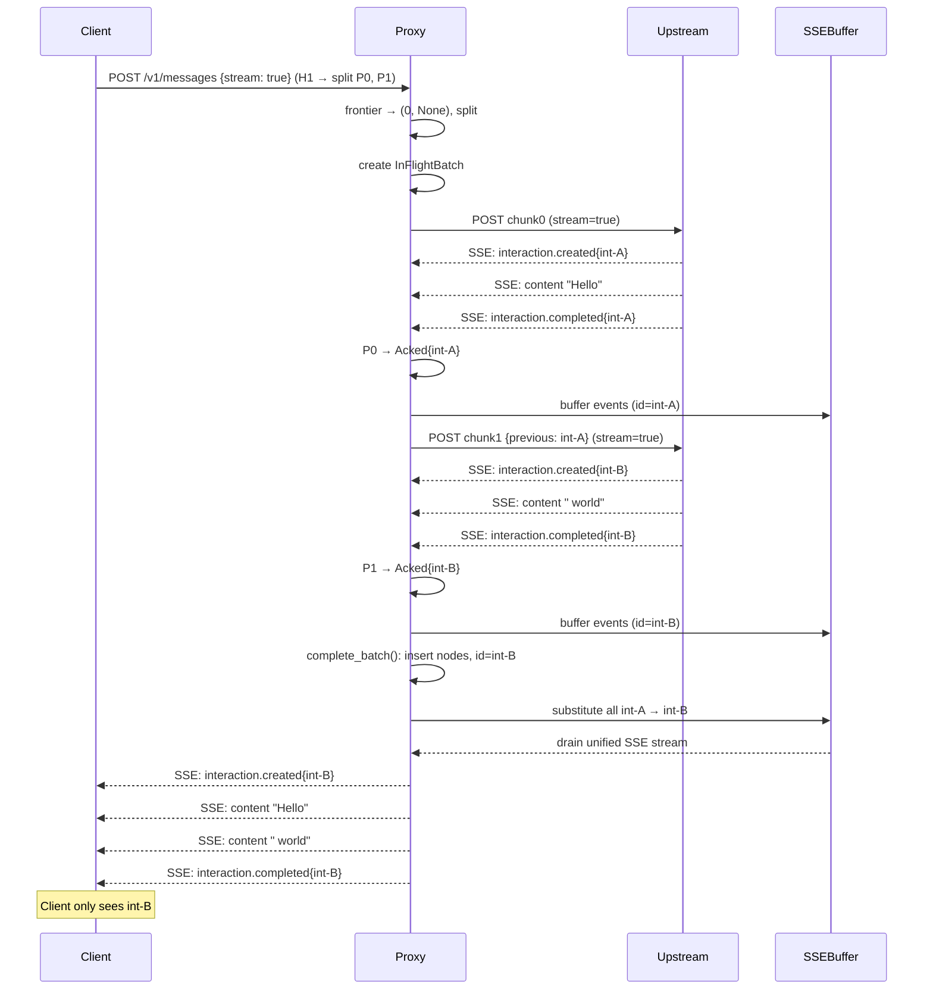

### Failure: SSE buffer overflow

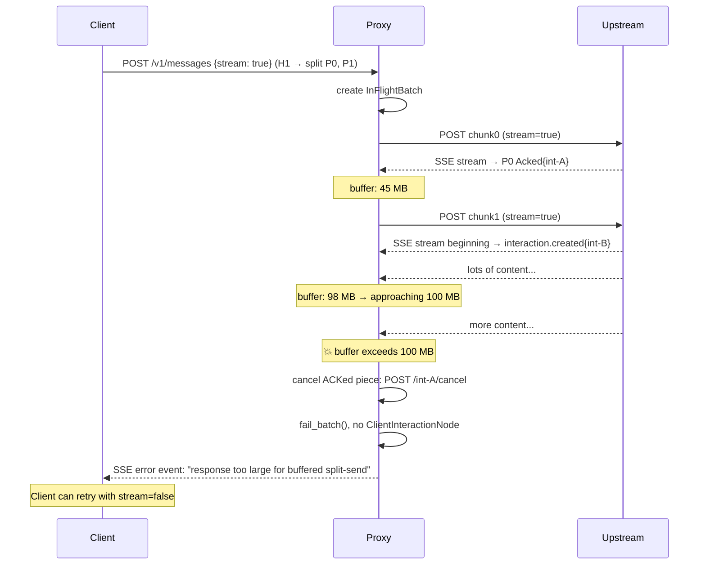

### Successful: Streaming split-send with system_instruction

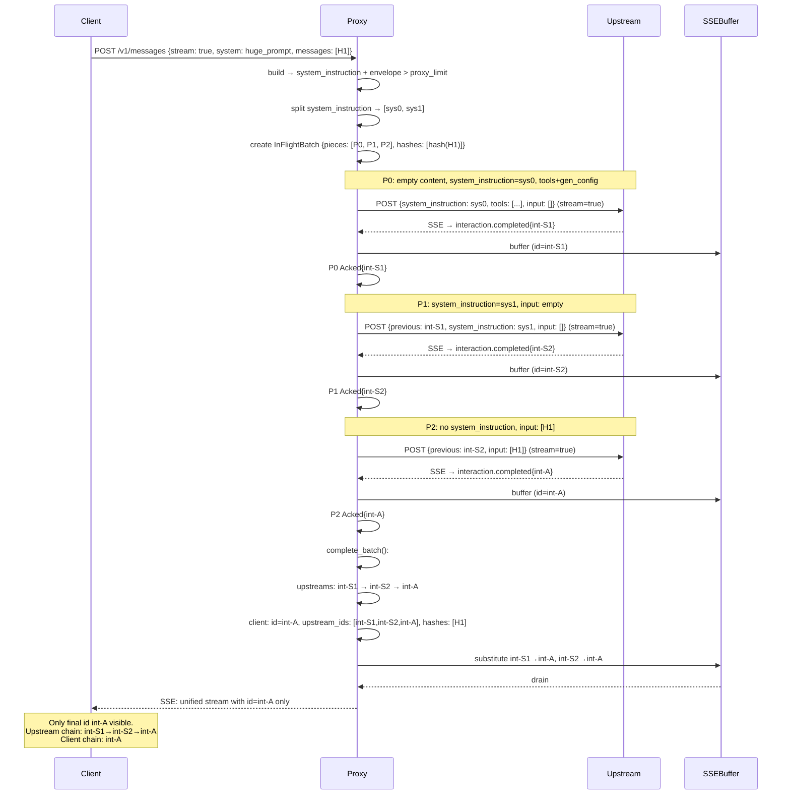
